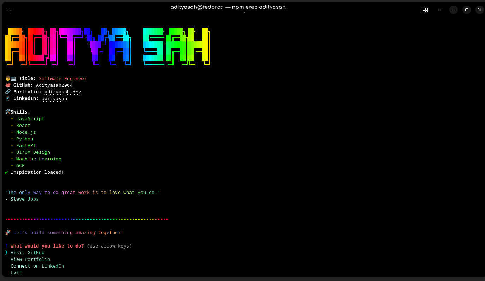

# CLI Business Card

A stylish command-line business card that showcases your profile with interactive animations and colors. This tool creates a unique way to share your professional information with fellow developers directly from the terminal.

)

## Features

- Animated text and loading effects
- Interactive clickable links
- Color gradients and styled text
- User interaction via menu choices
- Easy to customize with your own information

## Installation

You can install the CLI business card globally using npm:

```bash
npm install -g your-package-name
```

Or run it directly using npx:

```bash
npx your-package-name
```

## Creating Your Own CLI Business Card

### Prerequisites

- Node.js (v16 or later recommended)
- npm or yarn

### Step 1: Set Up Your Project

1. Create a new directory and initialize a new npm package:

```bash
mkdir my-cli-card
cd my-cli-card
npm init -y
```

2. Update your package.json to include:

```json
{
  "name": "your-username",
  "version": "1.0.0",
  "description": "My CLI Business Card",
  "main": "index.js",
  "type": "module",
  "bin": {
    "your-username": "cli.js"
  },
  "files": [
    "cli.js",
    "index.js",
    "lib"
  ]
}
```

### Step 2: Install Dependencies

Install the required packages:

```bash
npm install chalk chalk-animation figlet gradient-string inquirer nanospinner ora terminal-link minimist
```

Optional packages for enhanced styling:
```bash
npm install boxen cliui prettyjson
```

### Step 3: Create Project Files

#### Create cli.js

This is the entry point for the CLI command:

```javascript
#!/usr/bin/env node

import minimist from "minimist";
import pkg from "./index.js";

const options = { alias: { json: "j" } };
const argv = minimist(process.argv.slice(2), options);

pkg(argv);
```

#### Create index.js

```javascript
import displayBusinessCard from "./lib/data.js";

export default ({ json }) => {
  if (json) {
    return JSON.stringify({ message: "CLI Business Card" });
  }
  return displayBusinessCard();
};
```

#### Create lib/data.js

This is where all the business card functionality is implemented:

```javascript
import chalk from "chalk";
import figlet from "figlet";
import gradient from "gradient-string";
import ora from "ora";
import chalkAnimation from "chalk-animation";
import { createSpinner } from "nanospinner";
import terminalLink from "terminal-link";
import inquirer from "inquirer";

// Helper functions
const sleep = (ms = 1000) => new Promise((resolve) => setTimeout(resolve, ms));

async function typeWriter(text, delay = 10) {
  for (const char of text) {
    process.stdout.write(char);
    await sleep(delay);
  }
  process.stdout.write("\n");
}

async function displayBusinessCard() {
  console.clear();

  const spinner = createSpinner("Loading profile...").start();
  await sleep(1500);
  spinner.success({ text: "✅ Profile loaded!" });
  await sleep(500);

  // Your personal information
  const data = {
    name: "Your Name",  // Replace with your name
    title: "Your Title",  // Replace with your title
    github: "your-github-username",  // Replace with your GitHub username
    linkedin: "your-linkedin-username",  // Replace with your LinkedIn username
    portfolio: "your-website.com",  // Replace with your portfolio URL
    skills: [
      "JavaScript",
      "React",
      "Node.js",
      // Add your skills here
    ],
    urls: [
      "https://github.com/your-github-username",  // Replace with your GitHub URL
      "https://your-website.com",  // Replace with your portfolio URL
      "https://www.linkedin.com/in/your-linkedin-username",  // Replace with your LinkedIn URL
    ],
  };

  console.log("\n");
  const nameText = figlet.textSync(data.name, {
    font: "ANSI Shadow",
    horizontalLayout: "fitted",
  });

  const rainbowTitle = chalkAnimation.rainbow(nameText);
  await sleep(1500);
  rainbowTitle.stop();

  // Info content with typing effects
  await typeWriter(
    `${chalk.bold("👨‍💻 Title:")} ${chalk.hex("#FF6B6B")(data.title)}`
  );

  await typeWriter(
    `${chalk.bold("🐙 GitHub:")} ${terminalLink(data.github, data.urls[0])}`
  );

  await typeWriter(
    `${chalk.bold("🔗 Portfolio:")} ${terminalLink(
      data.portfolio,
      data.urls[1]
    )}`
  );

  await typeWriter(
    `${chalk.bold("📱 LinkedIn:")} ${terminalLink(
      data.linkedin,
      data.urls[2]
    )}\n`
  );

  await typeWriter(chalk.bold("🛠️ Skills:"));

  for (const skill of data.skills) {
    await typeWriter(`  ${chalk.yellow("•")} ${chalk.hex("#6BFF6B")(skill)}`);
  }

  const progressSpinner = ora("Loading inspiration...").start();
  await sleep(1500);
  progressSpinner.succeed("Inspiration loaded!");

  console.log("\n");
  await typeWriter(
    gradient.pastel('"Add your favorite quote here."')
  );
  await typeWriter(gradient.cristal("- Quote Author"));
  console.log("\n");

  await sleep(1000);
  console.log(
    gradient.rainbow(
      "----------------------------------------------------------"
    )
  );
  await typeWriter(
    gradient.retro("\n🚀 Let's build something amazing together!\n")
  );

  const response = await inquirer.prompt([
    {
      type: "list",
      name: "action",
      message: chalk.hex("#FF6B6B")("What would you like to do?"),
      choices: [
        { name: gradient.cristal("Visit GitHub"), value: "github" },
        { name: gradient.cristal("View Portfolio"), value: "portfolio" },
        { name: gradient.cristal("Connect on LinkedIn"), value: "linkedin" },
        { name: gradient.cristal("Exit"), value: "exit" },
      ],
    },
  ]);
  
  switch (response.action) {
    case "github":
      console.log(chalk.hex("#6BFF6B")(`\nOpening GitHub: ${data.urls[0]}\n`));
      break;
    case "portfolio":
      console.log(
        chalk.hex("#6BFF6B")(`\nOpening Portfolio: ${data.urls[1]}\n`)
      );
      break;
    case "linkedin":
      console.log(
        chalk.hex("#6BFF6B")(`\nOpening LinkedIn: ${data.urls[2]}\n`)
      );
      break;
    case "exit":
    default:
      const goodbyeSpinner = createSpinner("Preparing to exit...").start();
      await sleep(1000);
      goodbyeSpinner.success({ text: "👋 Thanks for visiting!" });
      console.log(gradient.rainbow("\nSee you next time!\n"));
  }
}

export default displayBusinessCard;

if (import.meta.url === `file://${process.argv[1]}`) {
  displayBusinessCard().catch(console.error);
}
```

### Step 4: Customize Your Business Card

1. Open `lib/data.js` and update the `data` object with your personal information:
   - Name
   - Title
   - GitHub username
   - LinkedIn username
   - Portfolio URL
   - Skills
   - URLs for links

2. Customize the styling:
   - Change color schemes by modifying hex values
   - Try different figlet fonts (run `figlet -l` to see available fonts)
   - Add or remove features based on your preferences

### Step 5: Test Your Business Card Locally

Run your business card to make sure it works as expected:

```bash
node cli.js
```

### Step 6: Publish to npm

1. Make sure you have an npm account. If not, create one:
```bash
npm adduser
```

2. Log in to your npm account:
```bash
npm login
```
3. (optional) after making changes and publishing a new version
```bash
npm version major
```

4. Publish your package:
```bash
npm publish
```

Note: Make sure your package name is unique and not already taken on npm.


### Step 7: Use Your Published Card

After publishing, you can run your business card using:

```bash
npx your-username
```

Or install it globally:

```bash
npm install -g your-username
your-username
```

## Customization Options

### Add a Boxed Layout

If you want to use boxen for a boxed layout, uncomment and use the boxen code in the data.js file:

```javascript
import boxen from "boxen";

// Later in your code:
const infoBox = boxen(infoContent, {
  padding: 1,
  margin: 1,
  borderStyle: "double",
  borderColor: "#FF6B6B",
  backgroundColor: "#1A1A1A",
});

console.log(infoBox);
```

### Add More Interactivity

You can enhance your business card with more interactive features:
- Add more menu options
- Include animated progress bars
- Add ASCII art or logos
- Include a small game or puzzle

### Change Animations

Experiment with different animations from chalk-animation:
- rainbow
- pulse
- glitch
- radar
- neon
- karaoke

## Troubleshooting

### Terminal Link Issues

If terminal links aren't working, make sure you're using a terminal that supports links, like iTerm2, modern versions of Terminal.app, or Windows Terminal.

### Color Support

If colors aren't displaying correctly, check your terminal's color support. Modern terminals should support most colors, but some may have limitations.

## License

This project is licensed under the MIT License - see the LICENSE file for details.

## Acknowledgments

- Inspiration from [sindresorhus/cli-boxes](https://github.com/sindresorhus/cli-boxes)
- Terminal styling packages by [Sindre Sorhus](https://github.com/sindresorhus)